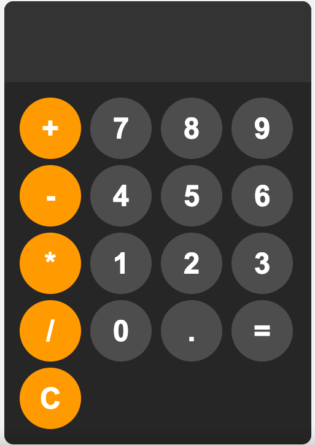

<h1>Calculator Project</h1>
This project is a simple web-based calculator implemented using HTML, CSS, and JavaScript. 
It provides basic arithmetic operations and a user-friendly interface for performing calculations.

<h2>Features</h2>
<ul>
  <li>Addition, subtraction, multiplication, and division operations.</li>
  <li>Clear button to reset the calculator display.</li>
  <li>Responsive design using HTML and CSS for layout and styling.</li>
  <li>Interactive functionality powered by JavaScript.</li>
</ul>

<h2>Technologies Used</h2>
<ul>
  <li><strong>HTML :</strong> Provides the structure of the calculator interface.</li>
  <li><strong>CSS :</strong> Styles the calculator layout and appearance.</li>
  <li><strong>JavaScript :</strong> Implements the calculator logic and user interactions.</li>
</ul>

<h2>Demo</h2>

<h3>How to Use</h3>
<ul>
  <li>Clone the repository: git clone https://github.com/your-username/calculator-project.git</li>
  <li>Open index.html in your web browser.</li>
  <li>Start performing calculations using the buttons provided.</li>
</ul>
 

